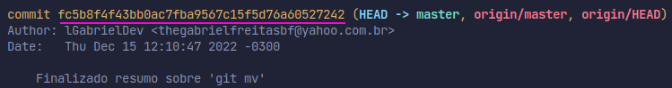

<h1 align="center">
    git reset
    
</h1>

## Introduction 

## Relembrando

- `git restore `--> Desconsidera uma alteração feita no arquivo. Usado antes de commitar.
  
- `git reset --hard commitHash#@#@#` --> Volta a versao do projeto para o commit que voce informar.

:bulb: Para localizar a hash de um commit, basta dar um `git log`.

Remundo... 

Fez uma alteração que não devia e ainda não commitou, dá um `git restore fileTal`.

Commitou errado, dá um `git reset --hard comitHash&#@&*#@` .
  

 

## Praticando :pencil2:

Crie um repositório e faça as seguintes operações:

1. Faça uma alteração no arquivo , sem commitar, e dê um `git restore`.
   
2. Faça uma alteração, commite, e volte o repositório para o commit anterior.
   

:warning: Lembrando que os commits do seu repositório local(seu pc) e os commits do repositório remoto precisam ter o mesmo número.

Se no repositório remoto tem 3 commits, no local têm que ter esses 3. Se não tiver, você não vai conseguir dar `git push`.

Preste muita atenção antes de commitar. Só commite quando tiver certeza.

 
 

<!-- Botão para próxima página -->

